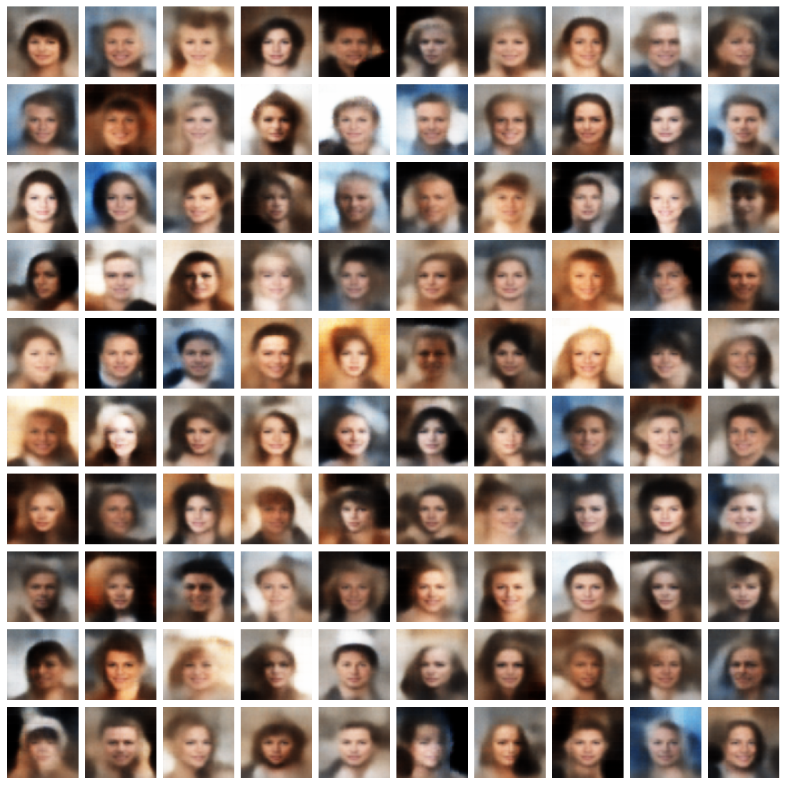

Exploratory Analysis of VAEs and WGANs for Image Generation Using CelebA Dataset
===

This project involves an exploratory analysis of the capabilities of Variational Autoencoders (VAEs) and Wasserstein Generative Adversarial Networks (WGANs) for image generation. The CelebA dataset is utilized for training and evaluating the models. The aim is to understand the strengths and weaknesses of VAEs and WGANs in generating high-quality images of faces and to explore the latent spaces of these models.

## Dataset Description

The [CelebA Dataset](https://www.kaggle.com/datasets/jessicali9530/celeba-dataset) contains 202,599 images of celebrity faces with large pose variations, background clutter, and diverse individuals. The dataset includes rich annotations, making it suitable for tasks such as face detection, facial attribute recognition, and image generation. This data was originally collected by researchers at MMLAB, The Chinese University of Hong Kong.

## Sample generated images

- VAE:



- WGAN:


## Install the environment in a local device
The following steps must be followed to install the dependencies required for running the application:

1. Navigate to the project directory
```
cd (`project_path`)
```

2. Create a conda environment from a .yml file
```
conda env create -f environment.yml
```

## Project Structure
The project is organized as follows:

```
├── datasets
│   ├── img_align_celeba
├── output
│   ├── "generated models"
```

## Dependencies
The main libraries used in this project include:

- TensorFlow
- Keras
- NumPy
- Scipy
- Scikit-image
- Pandas
- Matplotlib

## Model Architecture
The model is designed with the following architecture:

### Variational Autoencoder (VAE)
- Encoder: Encodes the input image into a latent space.
- Latent space: A probabilistic representation of the encoded input.
- Decoder: Decodes the latent space representation back into an image.

### Wasserstein Generative Adversarial Network (WGAN)
- Generator: Generates images from random noise.
- Discriminator (Critic): Distinguishes between real and generated images.
- Training Objective: Uses the Wasserstein distance to improve the stability of training.
